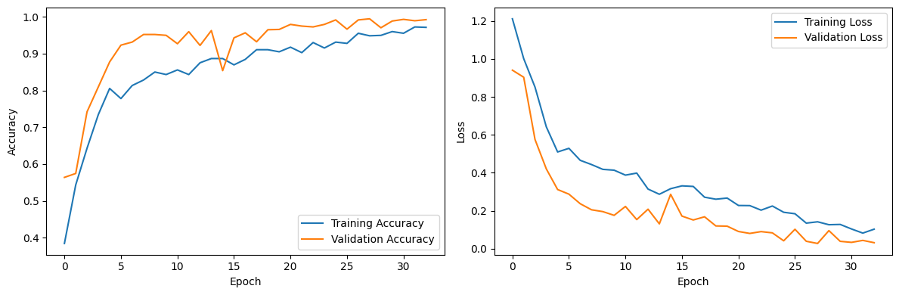

# KLASIFIKASI CITRA MENGGUNAKAN CNN
### 1.Ekstraksi Dataset: 
Bagian pertama program digunakan untuk mengekstrak dataset dari file zip yang berisi gambar tangan yang membentuk gunting, batu, atau kertas. Dataset ini adalah dataset "rockpaperscissors." (https://github.com/dicodingacademy/assets/releases/download/release/rockpaperscissors.zip) 
### 2.Pembagian Dataset: 
membagi dataset menjadi dua subset, yaitu train set dan validation set. Train set akan digunakan untuk melatih model, sementara validation set akan digunakan untuk menguji kinerja model selama pelatihan.
### 3.Augmentasi Gambar:
menggunakan ImageDataGenerator untuk melakukan augmentasi gambar pada dataset. Ini mencakup operasi seperti rotasi, pergeseran, pembesaran, dan pemutaran gambar. Augmentasi gambar membantu dalam meningkatkan keragaman dataset pelatihan.
### 4.Model Sequential: 
membangun model menggunakan Sequential. Model ini terdiri dari beberapa lapisan konvolusi dan lapisan terhubung (fully connected) untuk klasifikasi gambar.
### 5.Loss Function: 
menggunakan fungsi CategoricalCrossentropy karena ini adalah masalah klasifikasi multi-kelas, bukan biner.
### 6.Pelatihan Model: 
melakukan pelatihan model dengan memanggil model.fit() menggunakan generator data yang sudah disiapkan sebelumnya. Selama pelatihan, model belajar untuk mengklasifikasikan gambar tangan menjadi salah satu dari tiga kelas: gunting, batu, atau kertas.
### 7.Visualisasi: 
Setelah pelatihan, visualisasikan kinerja model dengan menggambar grafik akurasi dan kerugian pada set pelatihan dan validasi. Ini membantu memahami sejauh mana model berhasil belajar selama pelatihan.
### 8.Prediksi dengan Gambar Baru: 
menyediakan kode untuk melakukan prediksi dengan gambar baru yang tidak termasuk dalam dataset. Ini bermaksud untuk menguji kinerja model pada gambar-gambar yang belum pernah dilihat sebelumnya.

| EVALUASI MODEL                       |
|------------------------------------|
|  |